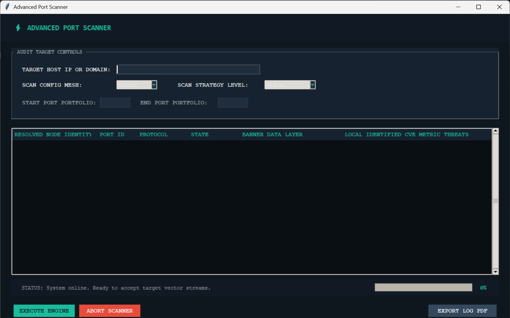

# Advanced-Port-Scanner
# ⚡ Advanced Network Port Scanner & Audit Engine

An asynchronous, multi-threaded network security scanner featuring a sleek, responsive dark-cyber GUI built with Python and Tkinter. This tool allows security operators and administrators to quickly audit network profiles, grab live protocol banners, evaluate baseline threat vulnerabilities (CVEs), and export formatted PDF summaries.

## 🚀 Features

* **Asynchronous Scan Architecture:** Built on top of Python's `concurrent.futures.ThreadPoolExecutor` for high-performance network socket probing.
* **Dual Port Targeting Modes:** Supports scanning single precise port identities or broad sequential port ranges.
* **Three Scanning Strategies:**
    * `Normal Scan`: Passive handshake verification to identify connection states.
    * `Service Scan` & `All Scan`: Aggressive, protocol-aware probing utilizing custom payload injections (`GET`, `SYST`, `HELO`) for deeper metadata signature capture.
* **Local CVE Threat Mapping:** References open ports against a baseline vulnerability signature list to flag immediate potential risks.
* **Log Export Engine:** Compiles and formats live scan results cleanly into structural PDF audit reports.
* **Modern Visual Interface:** Fully responsive, customized Tkinter styling optimized for low-light operator environments.

---

## 🛠️ Tech Stack & Dependencies

* **Language:** Python 3.x
* **UI Framework:** Tkinter / ttk (Built-in)
* **Networking:** Native `socket`, `threading`, and `concurrent.futures` 
* **PDF Generation:** `fpdf2`

---

## 💻 Installation & Setup

1. **Clone the repository:**
   ```bash
   git clone [https://github.com/YOUR-USERNAME/advanced-port-scanner.git](https://github.com/YOUR-USERNAME/advanced-port-scanner.git)
   cd advanced-port-scanner
   
2.Install required dependencies:
This script relies on the fpdf package to format the PDF export summaries. Install it using pip:

    Bash
    pip install fpdf
    
Run the Application:
    
    Bash
    python main.py


🛑 Disclaimer
This tool is designed strictly for educational purposes, defensive security auditing, and network management. Authorized security professionals should only execute scanning queries against target hosts where they have explicit, documented administrative permission. Unsanctioned network probing may violate local laws or trigger active firewall/IDS defensive protocols. Use responsibly.
                                
                                                      ---
  


